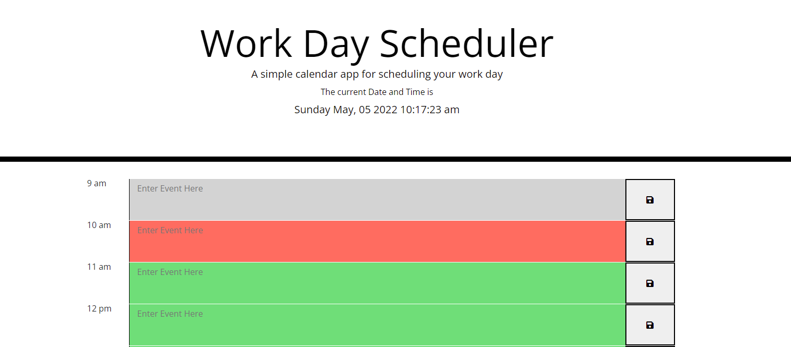

WorkDay Scheduler

For this project we were tasked with adding to the starter code of the workday schedule in order to add the wanted functionality to the application. 
We were tasked with making it so that the application could display the present date and time, would color code the text entry blocks in order to show whether or not the text block corresponded with a present hour, a past hour or an upcoming hour, the application also has the ability to save the tasks into the local storage and load those tasks onto the page even after having closed the application.  

Below are some screenshots to display the appearance of the application: 

The grey coloring is used for hours that have alreayd passed, the red line indicates that the current hour is equal to the hour of the taskbar, and the green coloring is used to indicate that the hour for the task has not passed. 

The deployed application can be found here:
https://emartinezcastellanos.github.io/Work-scheduler/ 
